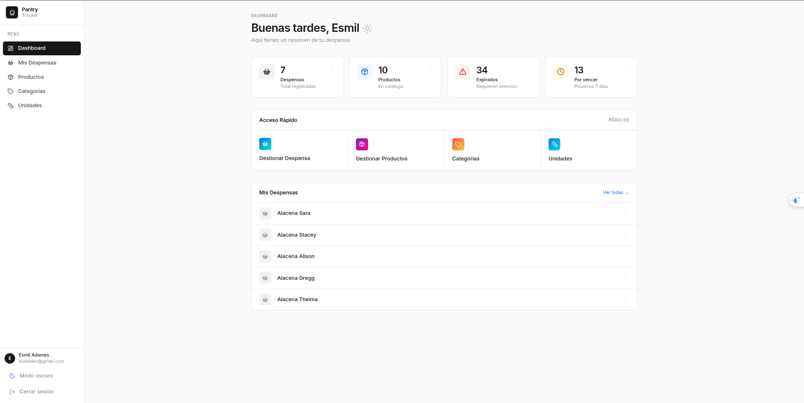
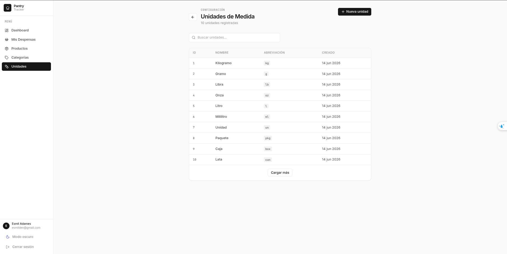
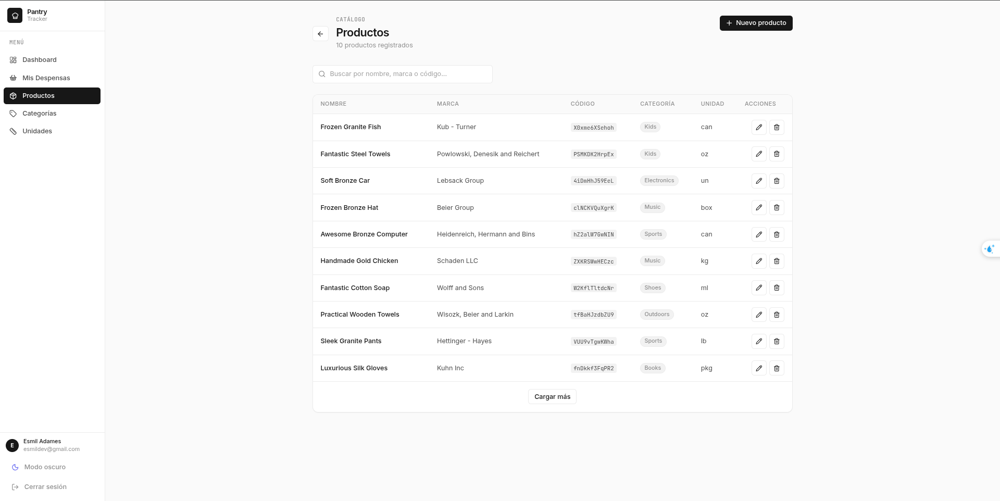
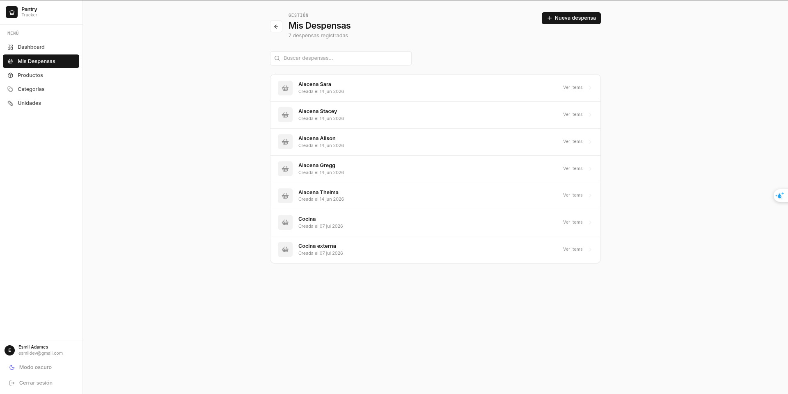

# Pantry Tracker

**Pantry Tracker** es una aplicación full-stack para la gestión inteligente del inventario de alimentos. Permite a los usuarios realizar un seguimiento de los productos de su despensa, gestionar fechas de vencimiento con clasificación automática de frescura, organizar unidades y categorías, y optimizar el consumo de alimentos reduciendo el desperdicio.

---

## 📸 Vista Previa

### Dashboard Principal

*Vista general del estado de la despensa con métricas clave: total de despensas, productos en catálogo, productos expirados y por vencer.*

---

### Gestión de Unidades

*Listado completo de unidades de medida con búsqueda y paginación.*

---

### Gestión de Productos

*CRUD completo de productos con búsqueda, filtros y acciones.*

---

### Mis Despensas

*Gestión de despensas con productos asociados y control de cantidades.*

---

## Características Principales

### 🖥️ Frontend
- **Dashboard interactivo** con métricas en tiempo real
- **CRUD completo** de productos, categorías, unidades y despensas
- **Clasificación inteligente** de frescura: `EXPIRED`, `CRITICAL`, `FRESH`
- **Búsqueda y filtrado** en todas las tablas
- **Modo oscuro** integrado
- **Autenticación JWT** con protección de rutas

### ⚙️ Backend
- **API RESTful** con arquitectura limpia Repository + Service Pattern
- **Autenticación segura** con hashing asíncrono usando Worker Threads Piscina
- **Rate Limiting** centralizado con Redis
- **Caché avanzado** para endpoints críticos
- **Reglas de vencimiento** inteligentes con zona horaria UTC unificada
- **Pruebas unitarias** con Vitest y Fake Timers
- **Escalabilidad** con PM2 en modo Cluster

---

## Stack Tecnológico

### Frontend

| Tecnología | Propósito |
|------------|-----------|
| **React 18** | Framework UI |
| **TypeScript** | Tipado estático |
| **Vite** | Build tool |
| **Tailwind CSS** | Estilos con sistema Geist |
| **React Query** | Gestión de estado del servidor |
| **React Hook Form + Zod** | Formularios y validación |
| **TanStack Table** | Tablas avanzadas con paginación |
| **Axios** | Cliente HTTP con interceptors |

### Backend

| Tecnología | Propósito |
|------------|-----------|
| **Node.js + Express** | API REST |
| **TypeScript** | Tipado estático |
| **Prisma** | ORM para SQL Server |
| **Redis** | Caché y Rate Limiting |
| **Piscina** | Worker Threads para hashing |
| **PM2** | Gestor de procesos en cluster |
| **Vitest** | Pruebas unitarias |
| **Autocannon** | Stress testing |
| **ClinicJS** | Profiling y monitoreo |

### Base de Datos

- **Microsoft SQL Server** contenedor Docker
- **Redis** contenedor Docker
